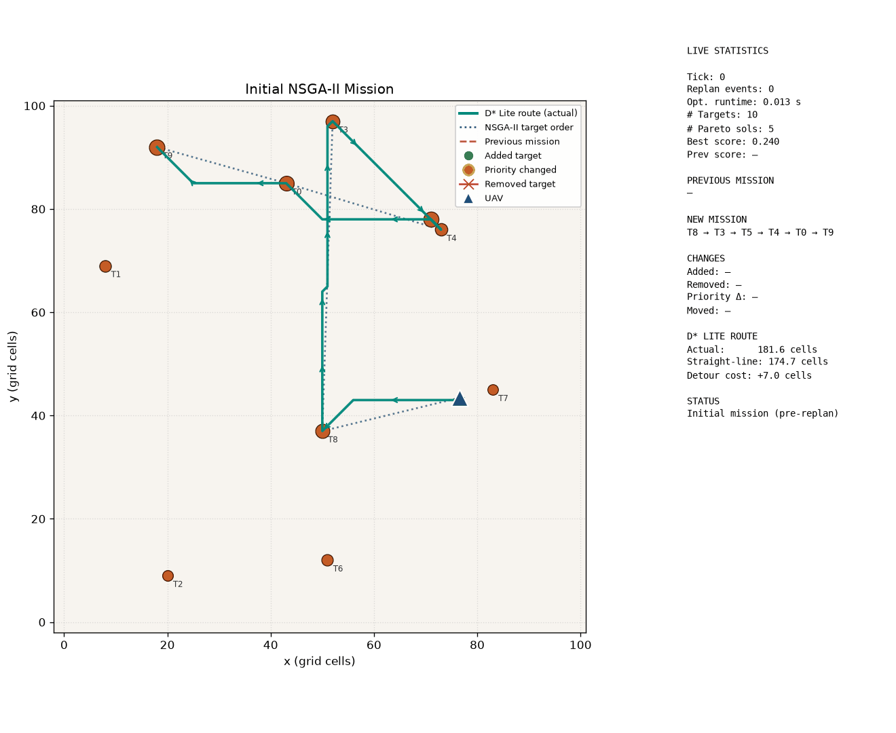

# Online Replanning Architecture Demo

Synthetic wildfire-prediction updates trigger NSGA-II replanning.
This demonstrates the CREDS-inspired online loop **before** ConvLSTM
and D* Lite are integrated.

## Configuration

- Initial targets: **10**
- Replan events: **3**
- Population size: **15**
- Generations / replan: **10**
- Animation FPS: **1.25**
- Hold frames / event: **10**
- Seed: **42**

## Initial Mission

- Optimization runtime: **0.009 s**
- Pareto solutions: **5**
- Mission score: **0.2404**
- Order: `T8 → T3 → T5 → T4 → T0 → T9`

## Artifacts

- GIF: `online_replan.gif`
- MP4: `online_replan.mp4`
- Frames: `frames/`
- Per-event CSV: `results/csv/online_replan_events.csv`
- Summary plot: `results/plots/online_replan_summary.png`

## Replan Event 1

### Suppression completed this tick

- Suppressed (flown to + removed, permanently excluded from future missions): **T8**

### Why replanning occurred

- Prediction source: `synthetic`
- Update note: synthetic prediction tick 1 (1 patch(es))
- Environment diff: moved [3]

### Mission change

- Previous: `T8 → T3 → T5 → T4 → T0 → T9`
- New: `T6 → T9 → T0 → T3 → T5 → T4`
- Score before: **0.2404**
- Score after: **0.2540** (Δ = +0.0136)
- Optimization runtime: **0.008 s**
- Targets after update: **9**
- Pareto solutions: **8**

Summary: synthetic prediction tick 1 (1 patch(es)). Diff: moved [3]. Mission T8 → T3 → T5 → T4 → T0 → T9 (score=0.240) → T6 → T9 → T0 → T3 → T5 → T4 (score=0.254).

## Replan Event 2

### Suppression completed this tick

- Suppressed (flown to + removed, permanently excluded from future missions): **T6**

### Why replanning occurred

- Prediction source: `synthetic`
- Update note: synthetic prediction tick 2 (3 patch(es))
- Environment diff: added [10]; priorityΔ [5, 7]

### Mission change

- Previous: `T6 → T9 → T0 → T3 → T5 → T4`
- New: `T10 → T5 → T3 → T4 → T0 → T9`
- Score before: **0.2540**
- Score after: **0.2064** (Δ = -0.0476)
- Optimization runtime: **0.007 s**
- Targets after update: **9**
- Pareto solutions: **4**

Summary: synthetic prediction tick 2 (3 patch(es)). Diff: added [10]; priorityΔ [5, 7]. Mission T6 → T9 → T0 → T3 → T5 → T4 (score=0.254) → T10 → T5 → T3 → T4 → T0 → T9 (score=0.206).

## Replan Event 3

### Suppression completed this tick

- Suppressed (flown to + removed, permanently excluded from future missions): **T10**

### Why replanning occurred

- Prediction source: `synthetic`
- Update note: synthetic prediction tick 3 (3 patch(es))
- Environment diff: priorityΔ [0, 1]; moved [7]

### Mission change

- Previous: `T10 → T5 → T3 → T4 → T0 → T9`
- New: `T0 → T4 → T5 → T3 → T9`
- Score before: **0.2064**
- Score after: **0.6414** (Δ = +0.4349)
- Optimization runtime: **0.008 s**
- Targets after update: **8**
- Pareto solutions: **5**

Summary: synthetic prediction tick 3 (3 patch(es)). Diff: priorityΔ [0, 1]; moved [7]. Mission T10 → T5 → T3 → T4 → T0 → T9 (score=0.206) → T0 → T4 → T5 → T3 → T9 (score=0.641).

## Future Integration Notes

1. Replace `SyntheticPredictionSource` with `ConvLSTMPredictionSource`
   that emits the same `PredictionUpdate` schema from predicted maps.
2. Pass each `MissionExecutionRequest` into `DStarLiteMissionExecutor`
   to locally refine waypoint-to-waypoint paths.
