# Wildfire UAV Mission Optimization — Experiment Report

Research evaluation of **pymoo NSGA-II** for single-UAV suppression
mission planning (synthetic targets; ConvLSTM integration pending).

## Shared Experimental Settings

- Grid: `100 x 100`
- Default target count (Exps 1/3/4): **12**
- Max mission targets: **8**
- Max mission distance: **250.0**
- Damage metric: `predicted_damage`
- Seed: `42`

## Experiment 1 — Convergence

- Number of targets: **12**
- Population size: **30**
- Generations (max): **50**
- Runtime: **0.065 s**

### Checkpoint Summary

| Generation | Best Damage | Avg Damage | Best Travel | Hypervolume | # Pareto |
|---:|---:|---:|---:|---:|---:|
| 10 | 5.1933 | 3.8105 | 165.2475 | 58430.6484 | 9 |
| 25 | 5.5865 | 4.0598 | 159.2589 | 63039.9374 | 30 |
| 50 | 5.5865 | 4.0919 | 159.2589 | 67229.5339 | 30 |

### Figures

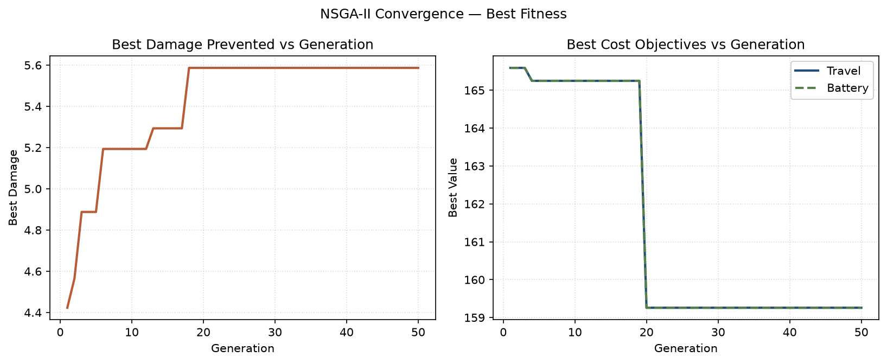

*Best fitness vs generation*

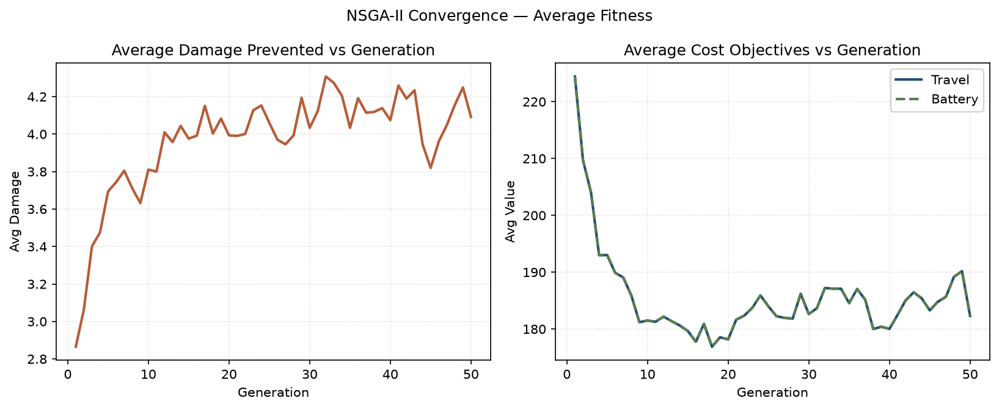

*Average fitness vs generation*

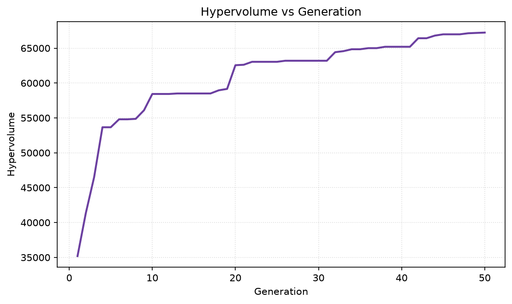

*Hypervolume vs generation*

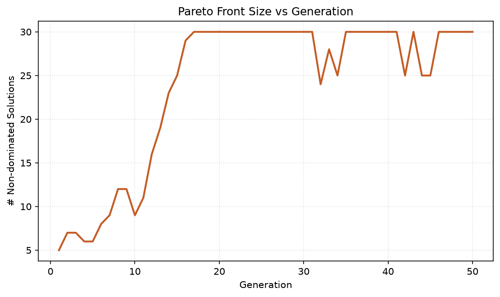

*Pareto front size vs generation*

CSV: `csv/convergence_history.csv`, `csv/convergence_checkpoints.csv`

## Experiment 2 — Runtime Scaling

- Population size: **25**
- Generations per run: **15**
- Trials per target count: **2**

| Targets | Mean Runtime (s) | Std (s) | Min | Max |
|---:|---:|---:|---:|---:|
| 10 | 0.016 | 0.002 | 0.015 | 0.017 |
| 20 | 0.014 | 0.000 | 0.014 | 0.014 |
| 30 | 0.015 | 0.000 | 0.014 | 0.015 |

### Figures

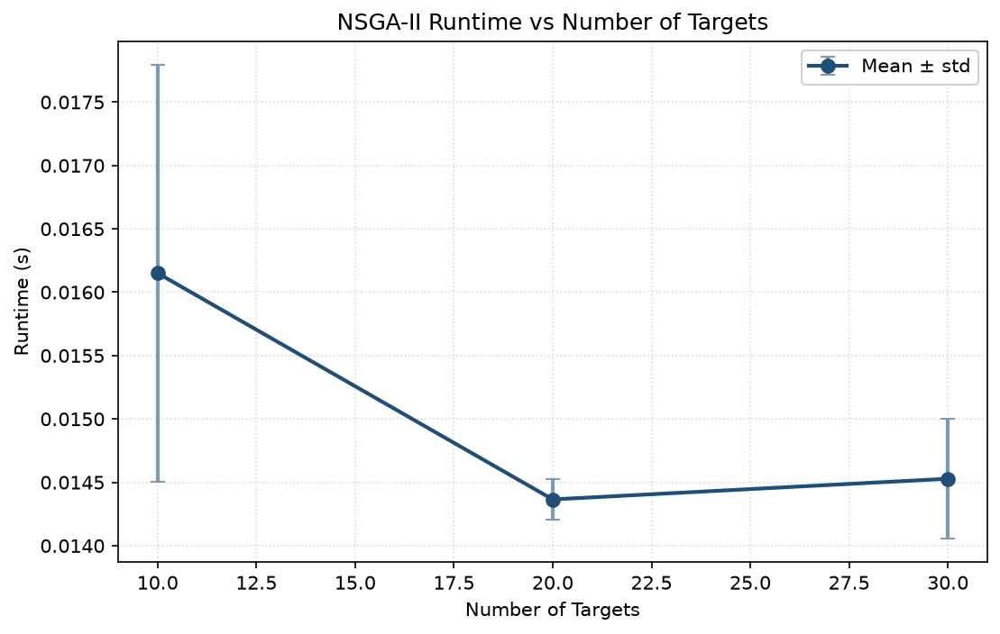

*Runtime vs number of targets*

CSV: `csv/runtime_scaling_trials.csv`, `csv/runtime_scaling_summary.csv`

## Experiment 3 — Population Size

- Number of targets: **12**
- Generations: **25**
- Trials per population size: **2**

| Pop. Size | Mean Runtime (s) | Best Damage (mean±std) | Best Travel (mean±std) | Pareto Size (mean±std) |
|---:|---:|---:|---:|---:|
| 25 | 0.028 | 5.8134 ± 0.0000 | 136.9712 ± 7.3353 | 6.00 ± 0.00 |
| 50 | 0.044 | 5.7924 ± 0.0000 | 137.3770 ± 35.4383 | 10.00 ± 0.00 |
| 100 | 0.081 | 5.7634 ± 0.0707 | 122.0513 ± 13.7645 | 5.50 ± 0.71 |

### Figures

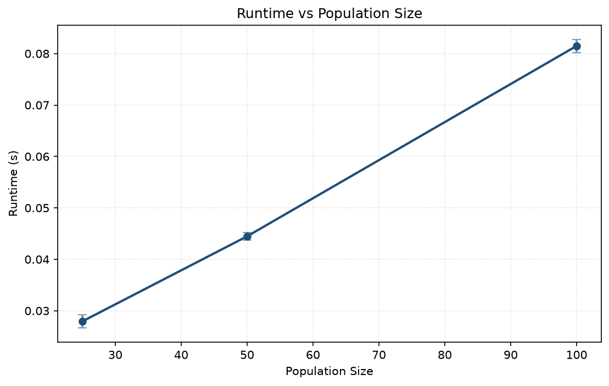

*Runtime vs population size*

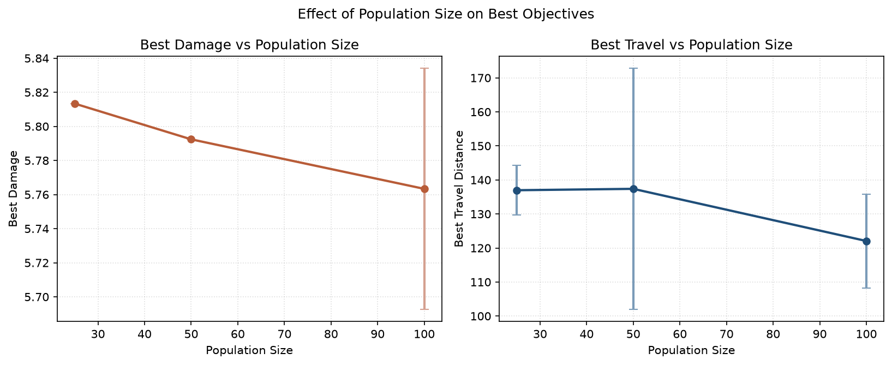

*Best objectives vs population size*

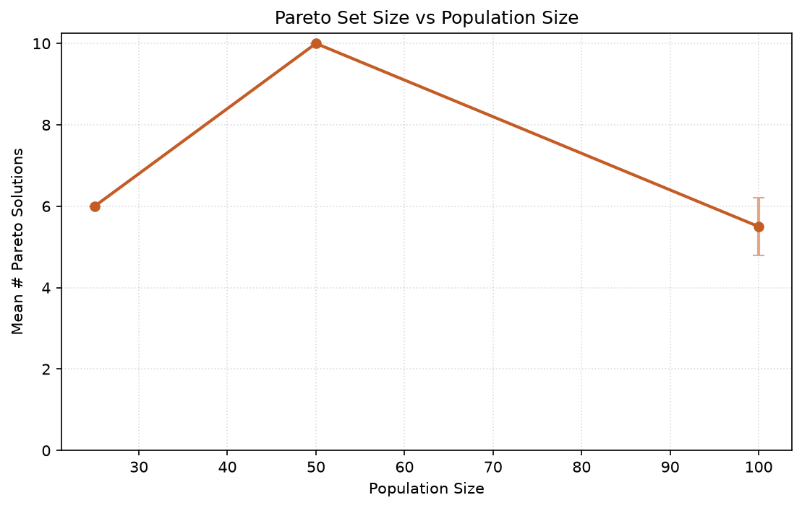

*Pareto set size vs population size*

CSV: `csv/population_size_trials.csv`, `csv/population_size_summary.csv`

## Experiment 4 — Mission Path Visualization

- Number of targets: **12**
- Population size: **40**
- Generations: **40**
- Runtime: **0.062 s**
- Number of Pareto solutions: **15**
- Selected mission index: **7** (knee / utopia-nearest)
- Mission order: `T5 → T4 → T3 → T0 → T11 → T8 → T2`
- Best objectives (selected): damage=4.8876, travel=173.9092, battery=173.9092

### Figures

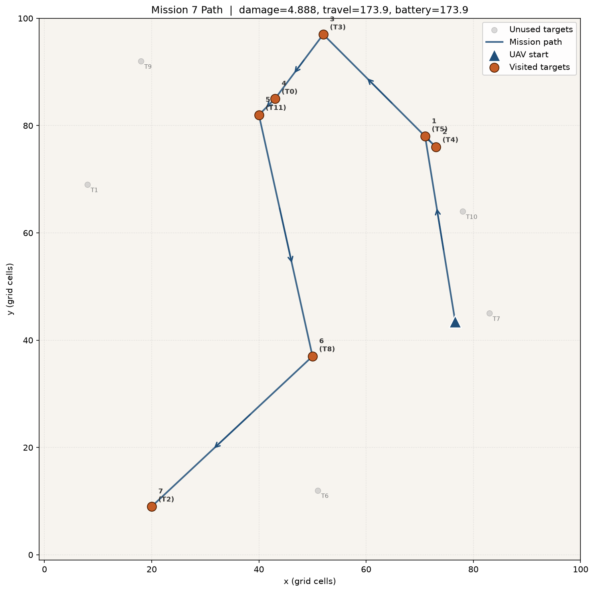

*Selected Pareto mission path*

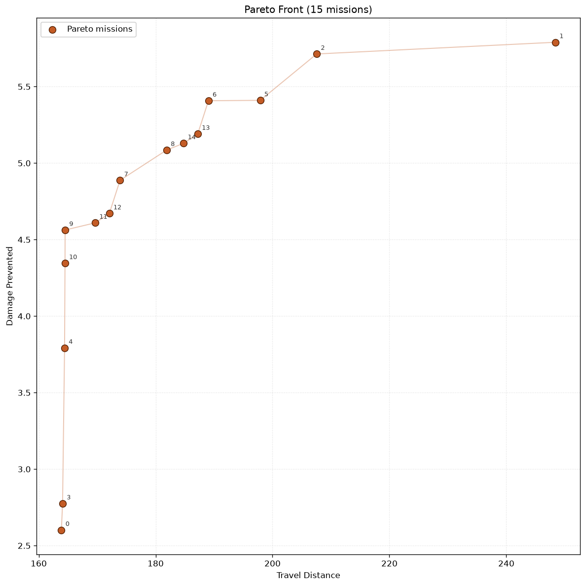

*Pareto front for path experiment*

CSV: `csv/mission_path_plans.csv`

## Experiment 5 — Generations to Convergence Threshold vs Problem Size

- Population size: **30**
- Max generations per run: **60**
- Trials per target count: **1**

| Targets | Gen@95% | Gen@98% | Gen@99% |
|---:|---:|---:|---:|
| 10 | 5.0 ± 0.0 | 37.0 ± 0.0 | 37.0 ± 0.0 |
| 20 | 46.0 ± 0.0 | 56.0 ± 0.0 | 56.0 ± 0.0 |
| 30 | 31.0 ± 0.0 | 31.0 ± 0.0 | 31.0 ± 0.0 |

### Figures

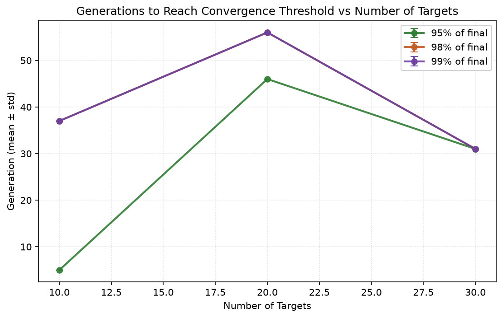

*Generations to reach 95/98/99% of final best fitness vs number of targets*

CSV: `csv/convergence_scaling_trials.csv`, `csv/convergence_scaling_summary.csv`

## Experiment 6 — Scenario Diversity

Same target count, three spatial/severity distributions: a single
uniform scatter is not evidence NSGA-II generalizes to realistic
multi-front, wind-driven fire scenarios.

| Scenario | Best Damage | Best Travel | Runtime (s) | Pareto Size |
|---|---:|---:|---:|---:|
| uniform | 5.5865 | 159.2589 | 0.066 | 8.0 |
| clustered | 5.3012 | 73.1662 | 0.064 | 5.0 |
| clustered_wind | 5.8686 | 63.5421 | 0.089 | 4.0 |

### Figures

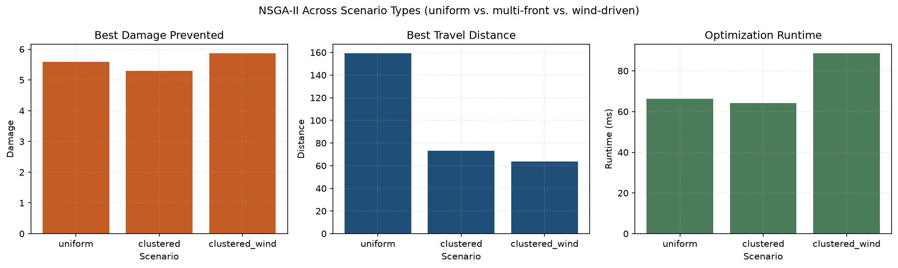

*Objectives/runtime across scenario types*

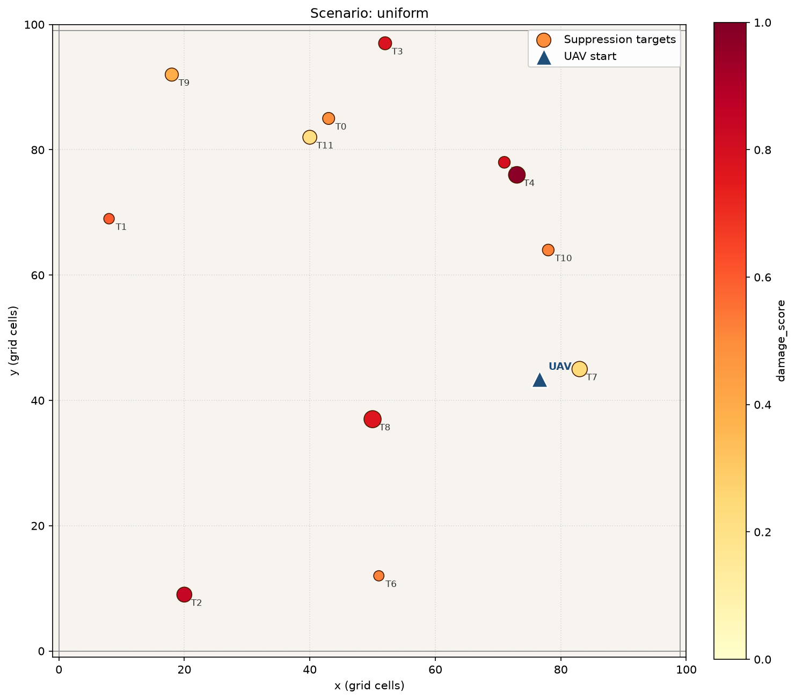

*Scenario scene: uniform*

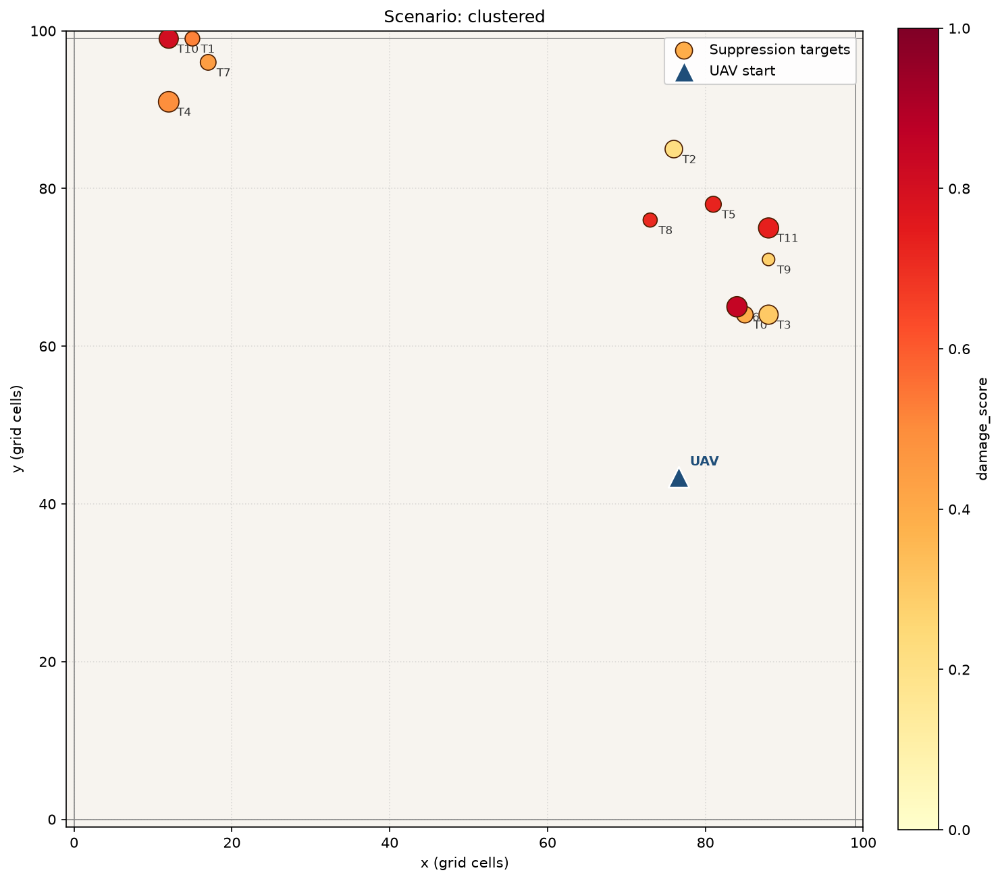

*Scenario scene: clustered*

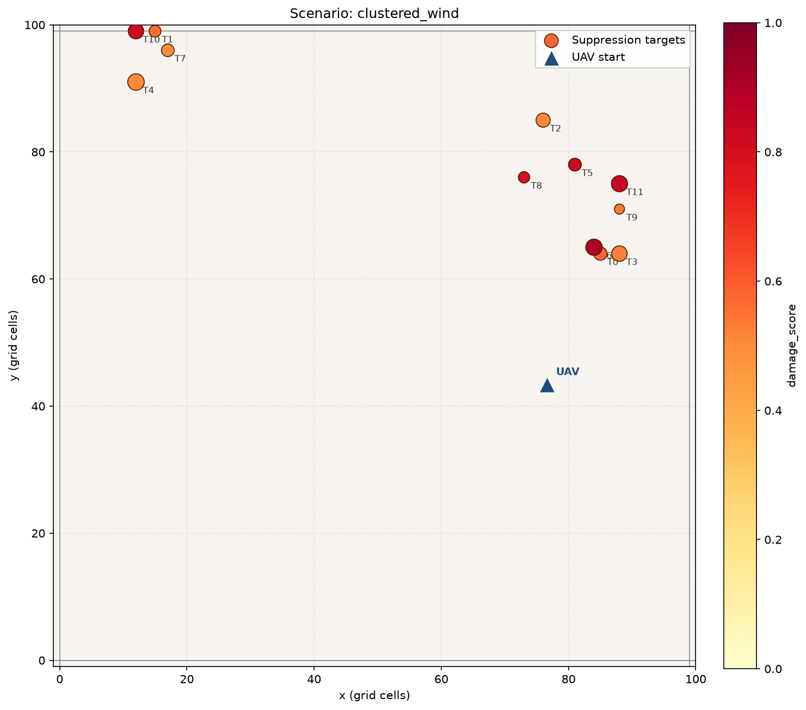

*Scenario scene: clustered_wind*

CSV: `csv/scenario_diversity.csv`

## Data Artifacts

- CSV directory: `csv`
- Plot directory: `plots`
- Config snapshot: `experiments/config_used.json`
