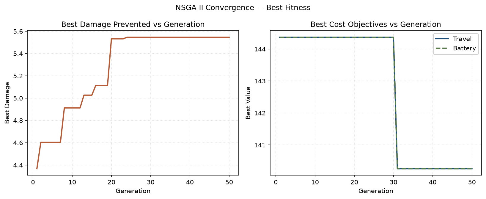
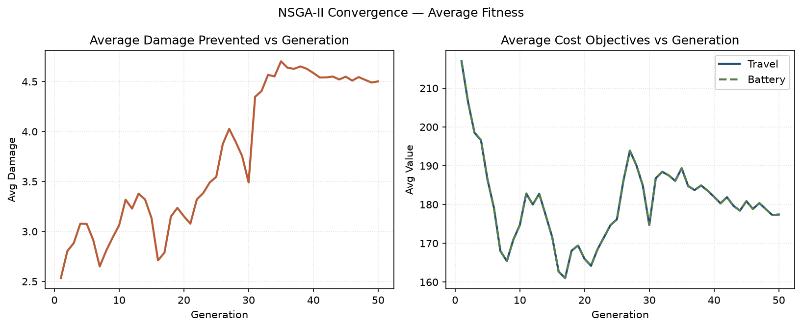
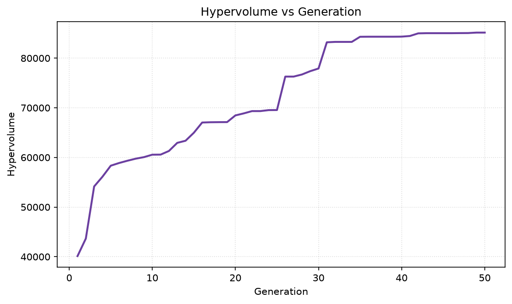
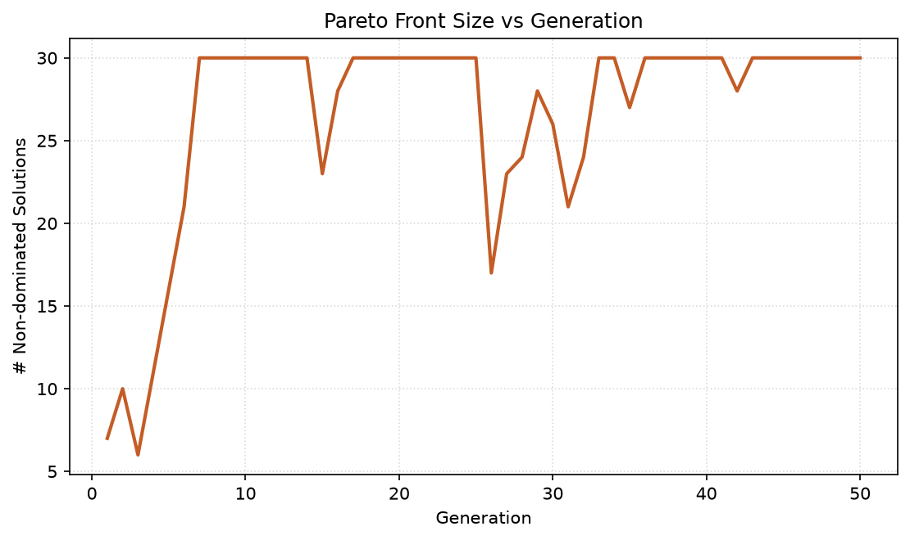
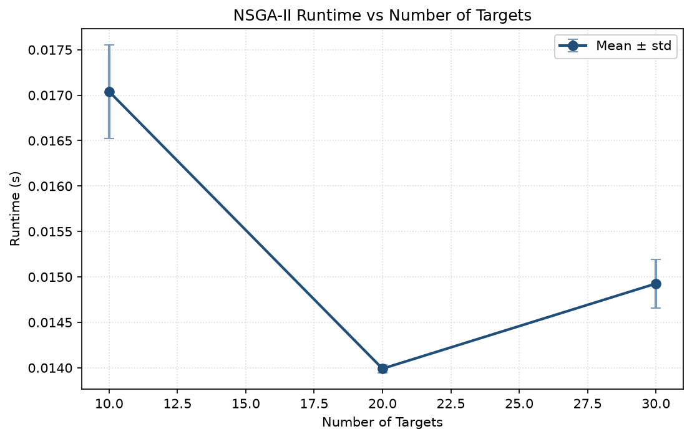
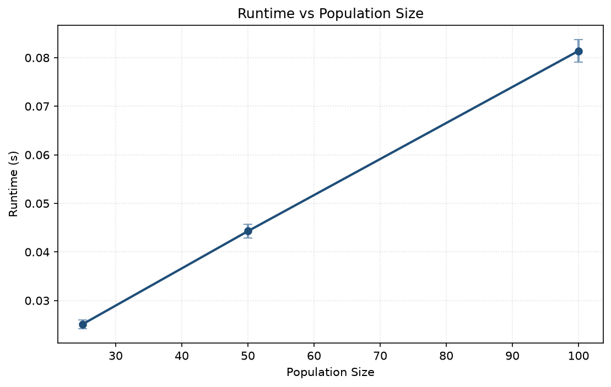
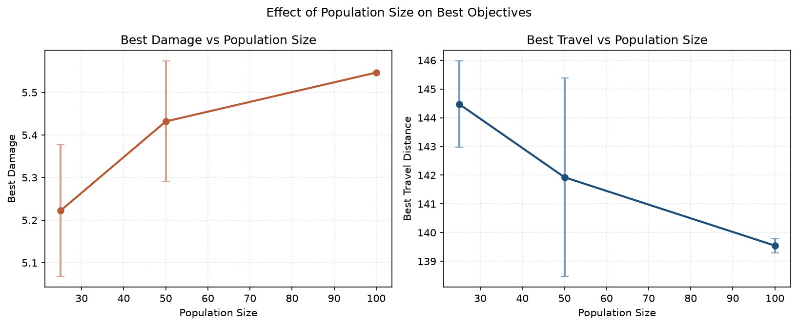
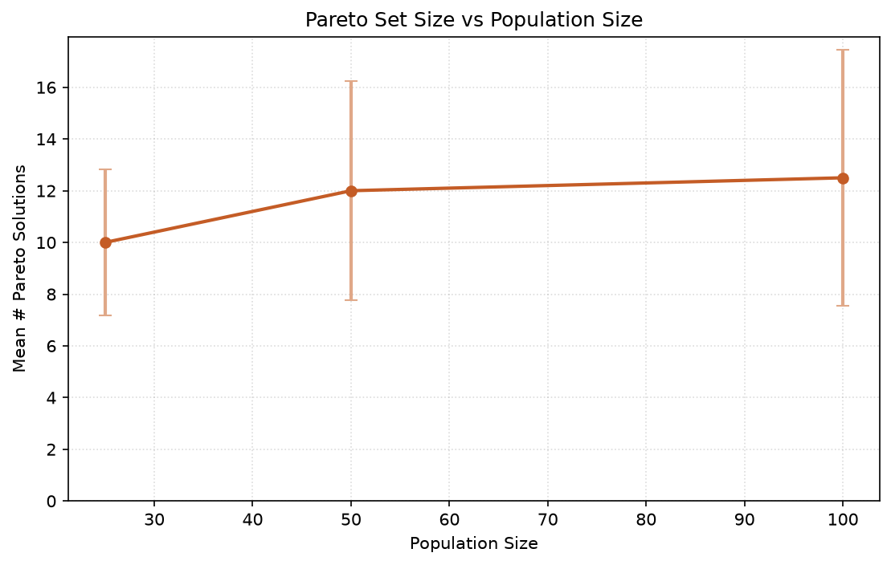
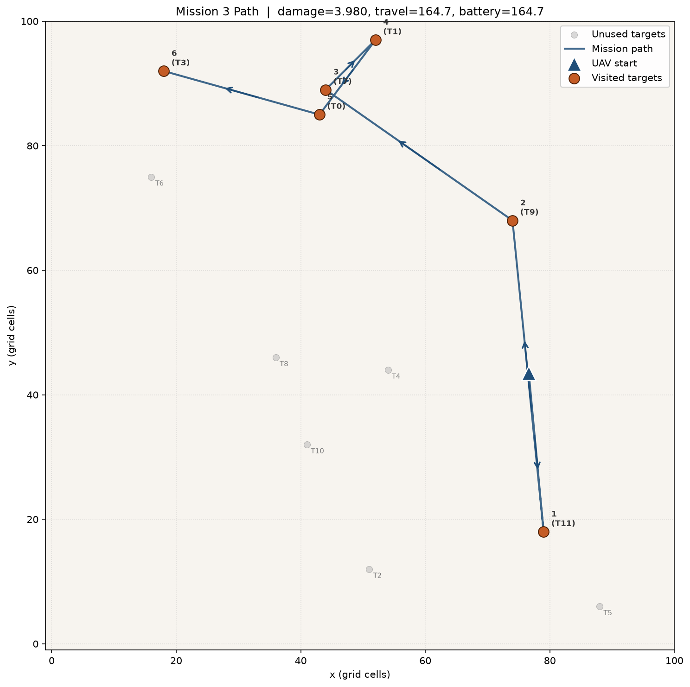
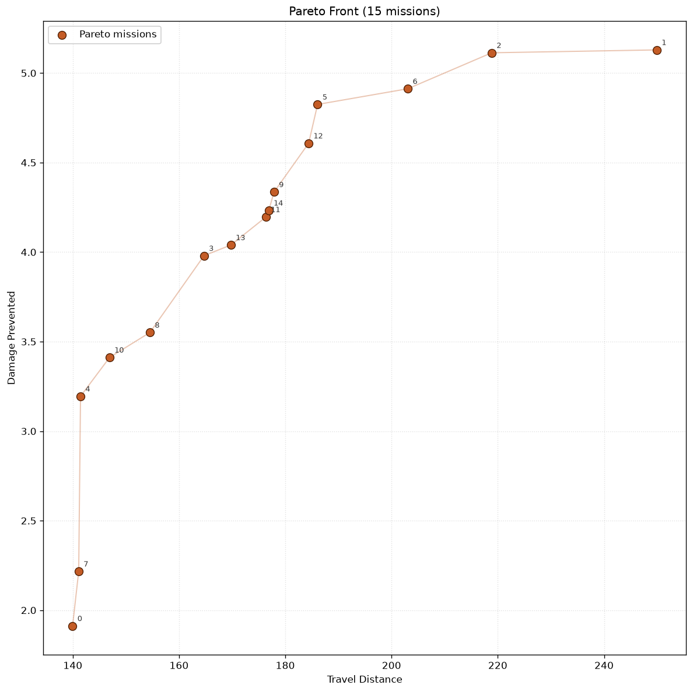

# Wildfire UAV Mission Optimization — Experiment Report

Research evaluation of **pymoo NSGA-II** for single-UAV suppression
mission planning (synthetic targets; ConvLSTM integration pending).

## Shared Experimental Settings

- Grid: `100 x 100`
- Default target count (Exps 1/3/4): **12**
- Max mission targets: **8**
- Max mission distance: **250.0**
- Damage metric: `predicted_damage`
- Seed: `42`

## Experiment 1 — Convergence

- Number of targets: **12**
- Population size: **30**
- Generations (max): **50**
- Runtime: **0.066 s**

### Checkpoint Summary

| Generation | Best Damage | Avg Damage | Best Travel | Hypervolume | # Pareto |
|---:|---:|---:|---:|---:|---:|
| 10 | 4.9123 | 3.0624 | 144.3676 | 60555.3440 | 30 |
| 25 | 5.5466 | 3.5467 | 144.3676 | 69547.5092 | 30 |
| 50 | 5.5466 | 4.5022 | 140.2565 | 85148.2653 | 30 |

### Figures

*Best fitness vs generation*

*Average fitness vs generation*

*Hypervolume vs generation*

*Pareto front size vs generation*

CSV: `csv/convergence_history.csv`, `csv/convergence_checkpoints.csv`

## Experiment 2 — Runtime Scaling

- Population size: **25**
- Generations per run: **15**
- Trials per target count: **2**

| Targets | Mean Runtime (s) | Std (s) | Min | Max |
|---:|---:|---:|---:|---:|
| 10 | 0.017 | 0.001 | 0.017 | 0.017 |
| 20 | 0.014 | 0.000 | 0.014 | 0.014 |
| 30 | 0.015 | 0.000 | 0.015 | 0.015 |

### Figures

*Runtime vs number of targets*

CSV: `csv/runtime_scaling_trials.csv`, `csv/runtime_scaling_summary.csv`

## Experiment 3 — Population Size

- Number of targets: **12**
- Generations: **25**
- Trials per population size: **2**

| Pop. Size | Mean Runtime (s) | Best Damage (mean±std) | Best Travel (mean±std) | Pareto Size (mean±std) |
|---:|---:|---:|---:|---:|
| 25 | 0.025 | 5.2223 ± 0.1543 | 144.4745 ± 1.5025 | 10.00 ± 2.83 |
| 50 | 0.044 | 5.4318 ± 0.1420 | 141.9266 ± 3.4520 | 12.00 ± 4.24 |
| 100 | 0.081 | 5.5466 ± 0.0000 | 139.5450 ± 0.2472 | 12.50 ± 4.95 |

### Figures

*Runtime vs population size*

*Best objectives vs population size*

*Pareto set size vs population size*

CSV: `csv/population_size_trials.csv`, `csv/population_size_summary.csv`

## Experiment 4 — Mission Path Visualization

- Number of targets: **12**
- Population size: **40**
- Generations: **40**
- Runtime: **0.059 s**
- Number of Pareto solutions: **15**
- Selected mission index: **3** (knee / utopia-nearest)
- Mission order: `T11 → T9 → T7 → T1 → T0 → T3`
- Best objectives (selected): damage=3.9799, travel=164.7041, battery=164.7041

### Figures

*Selected Pareto mission path*

*Pareto front for path experiment*

CSV: `csv/mission_path_plans.csv`

## Data Artifacts

- CSV directory: `csv`
- Plot directory: `plots`
